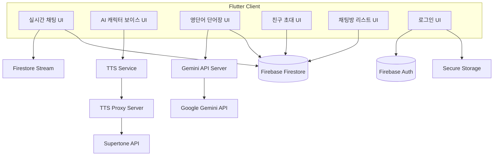

# machat

실시간 채팅 앱 마챗입니다.

## 목차
1. 프로젝트 목적
2. 아키텍쳐
3. 주요 기능
4. 설계 원칙
5. 패키지 구조 예시
6. 환경 설정
7. 라우팅 구조

## 프로젝트 목적
 - 친구들, 또는 AI와 소소하게 담소를 나눌 수 있는 앱
 - 마챗 토큰을 얻기 위해 다양한 학습 또는 계획 달성 등을 수행하는 앱

## 아키텍쳐

## 주요 기능
 - 실시간 채팅(유저간) 기능
 - 채팅 AI 캐릭터 보이스 기능
 - 영단어 단어장 기능(Gemini AI를 이용해 단어 생성)
 - 유저간 친구 초대 기능
 - 채팅방 입장 채팅방 리스트 관리 기능

## 설계 원칙
1. Routing :
   - goRouter 사용
   - 모듈별 라우트 분리
2. 디자인 패턴 :
   -  MVVM 기반
   -  Repository / Service 패턴 적용
3. 상태관리 :
   - Riverpod 사용
   - ViewModel 단위로 상태 구분
   - 전역 상태 최소화, KeepAlive 등으로 리소스 관리
4. 의존성 관리 :
   - DI 적극 활용
   - Riverpod ref 사용
5. UI/UX
   - 공통 디자인 시스템 구성 (Color, TextStyle, Button, Card)
   - 애니메이션 / 터치 피드백 통일
6. 데이터 관리
   - API 호출 / 캐싱 / 로컬 저장소 분리
   - 에러 핸들링 표준화 (SnackBar / Toast / Dialog)
   - 실시간 데이터는 Stream 관리
7. 보안
   - 토큰 관리: SecureStorage
   - 외부 API 키 보호 (환경변수 / Secret Manager)
8. 테스트
   - 테스트 없음
9. 성능
   - Lazy loading / Pagination 적용
   - 불필요한 rebuild 최소화

## lib 폴더별 설명  
animated_widget : 위젯에 overwrap 하여 사용하는 애니메이션 위젯  
assets : 이미지나 아이콘과 같은 에셋 모음  
config : 앱 설정 파일  
design_system : 버튼, 박스, 색깔 등 프로젝트 내에서 공통으로 사용하는 디자인 요소  
features : 각 기능별 폴더 모음  
features/models : 기능 내에서 사용하는 모델 모음  
features/screen : 라우터를 통해 직접적으로 진입하는 화면 프레임  
features/widgets : 해당 기능 스크린 명세에 의해 배치되는 위젯들  
features/repositories : 서버와 직접 통신하는 레포지토리  
features/providers : 상태 관리를 위한 riverpod provider 모음  
features/view_models : 화면 제어 및 서버 호출 등의 비지니스 로직을 담당하는 뷰모델 모음  
features/utils : 기능별 유틸리티 모음  

## 패키지 구조 예시

│  extensions.dart  
│  main.dart  
├─animated_widget  
│      animation_slide_up.dart  
│      lib.dart  
├─assets  
│  ├─icons  
│  │      chat-plus copy.svg  
│  │      chat-plus.svg  
│  │      crown.png  
│  │      enter.svg  
│  │      login.png  
│  │      logout.png  
│  │      person_plus.svg  
│  ├─images  
│  │      ma_chat.png  
│  └─lotties  
├─config  
│      firebase_config.dart  
├─design_system  
│  │  lib.dart  
│  ├─animations  
│  ├─buttons  
│  │      buttons.dart  
│  ├─check_box  
│  │      mc_check_box.dart  
│  ├─colors  
│  │      color.dart  
│  ├─inputs  
│  │      text_input.dart  
│  ├─sized_boxes.dart  
│  │      padding.dart  
│  │      space.dart  
│  └─utils  
├─features  
│  ├─chat  
│  │  │  lib.dart  
│  │  ├─expand  
│  │  │  ├─enums  
│  │  │  │      chat_contents_type.dart  
│  │  │  │      expand_state.dart  
│  │  │  ├─models  
│  │  │  │      chat_expand_model.dart  
│  │  │  │      chat_expand_model.freezed.dart  
│  │  │  │      chat_image_button_config.dart  
│  │  │  │      chat_image_list.dart  
│  │  │  │      chat_image_list.freezed.dart  
│  │  │  ├─providers  
│  │  │  │      expand_image_state_provider.dart  
│  │  │  │      expand_widget_state_provider.dart  
│  │  │  ├─repositories  
│  │  │  │      chat_image_repository.dart  
│  │  │  ├─view_models  
│  │  │  │      chat_image_view_model.dart  
│  │  │  │      chat_image_view_model.g.dart  
│  │  │  └─widgets  
│  │  │          chat_expand.dart  
│  │  │          chat_expand_brancher.dart  
│  │  │          chat_picture.dart  
│  │  │          chat_upload.dart  
│  │  ├─interface  
│  │  │      chat_view_model_interface.dart  
│  │  ├─models  
│  │  │      chat.dart  
│  │  │      chat.freezed.dart  
│  │  │      chat.g.dart  
│  │  │      image.dart  
│  │  │      image.freezed.dart  
│  │  │      image.g.dart  
│  │  ├─providers  
│  │  │      chat_focus_node_provider.dart  
│  │  │      chat_image_provider.dart  
│  │  │      chat_message_group_provider.dart  
│  │  │      chat_message_provider.dart  
│  │  │      chat_room_name_provider.dart  
│  │  │      chat_sending_widget_proivder.dart  
│  │  ├─repository  
│  │  │      chat_repository.dart  
│  │  ├─screens  
│  │  │      chat.dart  
│  │  ├─utils  
│  │  │      chat_utils.dart  
│  │  ├─view_models  
│  │  │      chat_view_model.dart  
│  │  │      chat_view_model.g.dart  
│  │  └─widgets  
│  │          chat_bubble.dart  
│  │          chat_contents.dart  
│  │          chat_image.dart  
│  │          chat_input.dart  
│  │          chat_profile.dart  
│  │          chat_sending_contents.dart  
│  ├─chat_create  
│  │  │  lib.dart  
│  │  ├─models  
│  │  │      chat_create_model.dart  
│  │  │      chat_create_model.freezed.dart  
│  │  ├─screens  
│  │  │      chat_create.dart  
│  │  ├─view_models  
│  │  │      chat_create_view_model.dart  
│  │  │      chat_create_view_model.g.dart  
│  │  └─widgets  
│  │          body.dart  
│  │          footer.dart  
│  │          header.dart  
│  ├─chat_expand_image  
│  │  ├─providers  
│  │  │      selected_image_url_provider.dart  
│  │  ├─screens  
│  │  │      expand_image.dart  
│  │  ├─view_models  
│  │  └─widgets  
│  ├─chat_list  
│  │  │  lib.dart  
│  │  ├─screens  
│  │  │      chat_list.dart  
│  │  ├─view_models  
│  │  │      chat_list_view_model.dart  
│  │  │      chat_list_view_model.g.dart  
│  │  └─widgets  
│  │          mobile.dart  
│  │          web.dart  
│  ├─common  
│  │  ├─caches  
│  │  │      shared_prefrences.dart  
│  │  ├─dialogs  
│  │  ├─interfaces  
│  │  │      cache_provider.dart  
│  │  │      cache_service.dart  
│  │  │      repository_service.dart  
│  │  ├─layouts  
│  │  │      default_layout.dart  
│  │  │      get_actions.dart  
│  │  │      lib.dart  
│  │  │      mobile_scaffold.dart  
│  │  │      web_scaffold.dart  
│  │  ├─login_module  
│  │  ├─models  
│  │  │      chat_list_model.dart  
│  │  │      chat_list_model.freezed.dart  
│  │  │      chat_room_data.dart  
│  │  │      chat_room_data.freezed.dart  
│  │  │      chat_room_data.g.dart  
│  │  │      friends_model.dart  
│  │  │      friends_model.freezed.dart  
│  │  │      members.dart  
│  │  │      members.freezed.dart  
│  │  │      members.g.dart  
│  │  │      user_data.dart  
│  │  │      user_data.freezed.dart  
│  │  │      user_data.g.dart  
│  │  ├─providers  
│  │  │      chat_room_id.dart  
│  │  │      friend_list.dart  
│  │  │      user_cache_providers.dart  
│  │  ├─repositories  
│  │  │      chat_room_crud_repository.dart  
│  │  │      friend_crud_repository.dart  
│  │  │      user_repository.dart  
│  │  ├─utils  
│  │  │      chat_key_generator.dart  
│  │  │      completer.dart  
│  │  │      date_parser.dart  
│  │  │      error_widget.dart  
│  │  │      extractor.dart  
│  │  │      get_color.dart  
│  │  │      loading_overtime.dart  
│  │  │      logout_util.dart  
│  │  │      router_utils.dart  
│  │  │      throttle.dart  
│  │  │      timestamp_converter.dart  
│  │  │      user_checker.dart  
│  │  ├─view_models  
│  │  │      chat_room_crud_view_model.dart  
│  │  │      chat_room_crud_view_model.g.dart  
│  │  │      friend_list_view_model.dart  
│  │  │      friend_list_view_model.g.dart  
│  │  │      user_view_model.dart  
│  │  │      user_view_model.g.dart  
│  │  └─widgets  
│  │          mc_check_box_view.dart  
│  ├─drawer  
│  │  │  lib.dart  
│  │  ├─models  
│  │  │      drawer_model.dart  
│  │  │      drawer_model.freezed.dart  
│  │  ├─repository  
│  │  │      drawer_repository.dart  
│  │  ├─screens  
│  │  │      mc_drawer.dart  
│  │  ├─view_models  
│  │  │      mc_drawer_view_model.dart  
│  │  │      mc_drawer_view_model.g.dart  
│  │  └─widgets  
│  │          drawer_chat_list.dart  
│  │          drawer_profile.dart  
│  │          drawer_router.dart  
│  ├─floating_button  
│  │  │  lib.dart  
│  │  ├─model  
│  │  ├─repository  
│  │  │      floating_button_repository.dart  
│  │  ├─screens  
│  │  │      mc_floationg_button.dart  
│  │  ├─view_model  
│  │  │      floating_button_view_model.dart  
│  │  │      floating_button_view_model.g.dart  
│  │  └─widgets  
│  ├─home  
│  │  │  lib.dart  
│  │  ├─repositories  
│  │  │      chat_room_repository.dart  
│  │  ├─screens  
│  │  │      home_page.dart  
│  │  ├─view_models  
│  │  │      chat_list_view_model.dart  
│  │  │      chat_list_view_model.g.dart  
│  │  │      friends_view_model.dart  
│  │  │      friends_view_model.g.dart  
│  │  └─widgets  
│  │          chat_list.dart  
│  │          delete_chat_room_dialog.dart  
│  │          firends.dart  
│  │          friends_page_widgets.dart  
│  │          friend_list.dart  
│  │          home_bundle.dart  
│  │          my_info.dart  
│  ├─loading  
│  │  │  lib.dart  
│  │  ├─screens  
│  │  │      loading_widget.dart  
│  │  └─view_models  
│  │          loading_view_model.dart  
│  ├─login  
│  │  │  lib.dart  
│  │  ├─models  
│  │  │      login_model.dart  
│  │  │      login_model.freezed.dart  
│  │  ├─repository  
│  │  │      login_repository.dart  
│  │  ├─screens  
│  │  │      login_page.dart  
│  │  │      web.dart  
│  │  ├─view_models  
│  │  │      login_view_model.dart  
│  │  │      login_view_model.g.dart  
│  │  └─widgets  
│  │          bundle_body.dart  
│  │          bundle_footer.dart  
│  │          bundle_header.dart  
│  │          login_bundle.dart  
│  ├─profile  
│  │  ├─models  
│  │  │      profile_model.dart  
│  │  │      profile_model.freezed.dart  
│  │  ├─providers  
│  │  │      profile_user_provider.dart  
│  │  ├─repository  
│  │  │      profile_repository.dart  
│  │  ├─screens  
│  │  │      my_profile.dart  
│  │  │      other_profile.dart  
│  │  ├─utils  
│  │  │      call_profile.dart  
│  │  │      define_is_friend.dart  
│  │  ├─view_models  
│  │  │      profile_view_model.dart  
│  │  │      profile_view_model.g.dart  
│  │  └─widgets  
│  │      │  profile_background.dart  
│  │      ├─my_profile  
│  │      │      profile_auth_button.dart  
│  │      │      profile_body.dart  
│  │      │      profile_bundle.dart  
│  │      │      profile_footer.dart  
│  │      │      profile_header.dart  
│  │      └─other_profile.dart  
│  │              profile_auth_button.dart  
│  │              profile_body.dart  
│  │              profile_bundle.dart  
│  │              profile_footer.dart  
│  │              profile_header.dart  
│  ├─profile_detail  
│  │  ├─models  
│  │  ├─screens  
│  │  ├─view_models  
│  │  └─widgets  
│  ├─register  
│  │  │  lib.dart  
│  │  ├─models  
│  │  │      register_model.dart  
│  │  │      register_model.freezed.dart  
│  │  ├─repository  
│  │  │      register_repository.dart  
│  │  ├─screens  
│  │  │      register_page.dart  
│  │  ├─utils  
│  │  │      validation.dart  
│  │  ├─view_models  
│  │  │      register_view_model.dart  
│  │  │      register_view_model.g.dart  
│  │  └─widgets  
│  │          bundle_body.dart  
│  │          bundle_footer.dart  
│  │          bundle_header.dart  
│  │          register_bundle.dart  
│  ├─snack_bar_manager  
│  │  │  lib.dart  
│  │  ├─models  
│  │  │      snack_bar_manager_data.dart  
│  │  │      snack_bar_manager_data.freezed.dart  
│  │  ├─provider  
│  │  │      snack_bar_manager.dart  
│  │  ├─screen  
│  │  │      snack_bar_manager.dart  
│  │  └─utils  
│  │          snack_bar_caller.dart  
│  └─splash  
│      │  lib.dart  
│      ├─models  
│      ├─repository  
│      ├─screens  
│      │      splash_page.dart  
│      └─view_models  
└─router  
        lib.dart  
        router.dart  
        router_path.dart  
