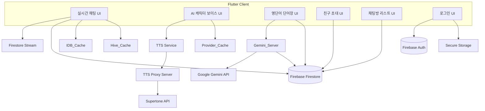

# machat

실시간 채팅 앱 마챗입니다.

## 목차
1. 프로젝트 목적
2. 아키텍쳐
3. 주요 기능
4. 설계 원칙
5. 패키지 구조 예시
6. 환경 설정
7. 라우팅 구조

## 프로젝트 목적
 - 친구들, 또는 AI와 소소하게 담소를 나눌 수 있는 앱
 - 마챗 토큰을 얻기 위해 다양한 학습 또는 계획 달성 등을 수행하는 앱

## 아키텍쳐

```mermaid
graph TB

    %% --- 클라이언트 ---
    subgraph Client[Flutter Client]
        ChatUI[실시간 채팅 UI]
        VoiceUI[AI 캐릭터 보이스 UI]
        VocabUI[영단어 단어장 UI]
        InviteUI[친구 초대 UI]
        RoomListUI[채팅방 리스트 UI]
        LoginUI[로그인 UI]
    end
    
    %% --- Firebase 공통 (먼저 정의) ---
    FS_DB[(Firebase Firestore)]
    FB_Auth[(Firebase Auth)]
    
    %% --- 실시간 채팅 ---
    ChatUI --> FS_Stream[Firestore Stream];
    ChatUI --> FS_DB;
    ChatUI --> Web_Cache[IDB_Cache];
    ChatUI --> Mobile_Cache[Hive_Cache];
    Gemini_Server --> Gemini_API[Google Gemini API];
    
    %% --- AI 캐릭터 보이스 ---
    VoiceUI --> TTS_Service[TTS Service];
    VoiceUI --> Provider_Cache[Provider_Cache];
    TTS_Service --> TTS_Proxy[TTS Proxy Server];
    TTS_Proxy --> Supertone[Supertone API];
    
    %% --- 단어장 기능 ---
    VocabUI --> Gemini_Server;
    VocabUI --> FS_DB;
    Gemini_Server --> FS_DB;
    
    %% --- 친구 초대 ---
    InviteUI --> FS_DB;
    
    %% --- 채팅방 리스트 관리 ---
    RoomListUI --> FS_DB;
    
    %% --- 로그인 기능 ---
    LoginUI --> FB_Auth;
    LoginUI --> SecureStorage[Secure Storage];
```

## 주요 기능
 - 실시간 채팅(유저간) 기능
 - 채팅 AI 캐릭터 보이스 기능
 - 영단어 단어장 기능(Gemini AI를 이용해 단어 생성)
 - 유저간 친구 초대 기능
 - 채팅방 입장 채팅방 리스트 관리 기능
 - AI 채팅 기능능

## 설계 원칙
1. Routing :
   - goRouter 사용
   - 모듈별 라우트 분리
2. 디자인 패턴 :
   -  MVVM 기반
   -  Repository / Service 패턴 적용
3. 상태관리 :
   - Riverpod 사용
   - ViewModel 단위로 상태 구분
   - 전역 상태 최소화, KeepAlive 등으로 리소스 관리
4. 의존성 관리 :
   - DI 적극 활용
   - Riverpod ref 사용
5. UI/UX
   - 공통 디자인 시스템 구성 (Color, TextStyle, Button, Card)
   - 애니메이션 / 터치 피드백 통일
6. 데이터 관리
   - API 호출 / 캐싱 / 로컬 저장소 분리
   - 에러 핸들링 표준화 (SnackBar / Toast / Dialog)
   - 실시간 데이터는 Stream 관리
7. 보안
   - 토큰 관리: SecureStorage
   - 외부 API 키 보호 (환경변수 / Secret Manager)
8. 테스트
   - 테스트 없음
9. 성능
   - Lazy loading / Pagination 적용
   - 불필요한 rebuild 최소화

## lib 폴더별 설명  
animated_widget : 위젯에 overwrap 하여 사용하는 애니메이션 위젯  
assets : 이미지나 아이콘과 같은 에셋 모음  
config : 앱 설정 파일  
design_system : 버튼, 박스, 색깔 등 프로젝트 내에서 공통으로 사용하는 디자인 요소  
features : 각 기능별 폴더 모음  
features/models : 기능 내에서 사용하는 모델 모음  
features/screen : 라우터를 통해 직접적으로 진입하는 화면 프레임  
features/widgets : 해당 기능 스크린 명세에 의해 배치되는 위젯들  
features/repositories : 서버와 직접 통신하는 레포지토리  
features/providers : 상태 관리를 위한 riverpod provider 모음  
features/view_models : 화면 제어 및 서버 호출 등의 비지니스 로직을 담당하는 뷰모델 모음  
features/utils : 기능별 유틸리티 모음  
