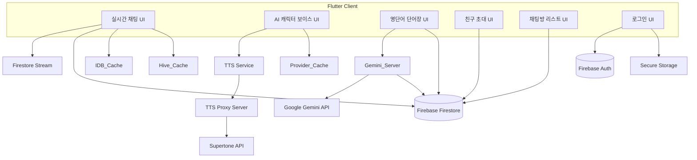

# machat

실시간 채팅 앱 마챗입니다.

## 목차
1. 프로젝트 목적
2. 아키텍쳐
3. 주요 기능
4. 설계 원칙
5. 패키지 구조 예시
6. 환경 설정
7. 라우팅 구조

## 프로젝트 목적
 - 친구들, 또는 AI와 소소하게 담소를 나눌 수 있는 앱
 - 마챗 토큰을 얻기 위해 다양한 학습 또는 계획 달성 등을 수행하는 앱

## 아키텍쳐


```mermaid
graph TB

    %% --- 클라이언트 ---
    subgraph Client[Flutter Client]
        ChatUI[실시간 채팅 UI]
        VoiceUI[AI 캐릭터 보이스 UI]
        VocabUI[영단어 단어장 UI]
        InviteUI[친구 초대 UI]
        RoomListUI[채팅방 리스트 UI]
        LoginUI[로그인 UI]
    end
    
    %% --- Firebase 공통 (먼저 정의) ---
    FS_DB[(Firebase Firestore)]
    FB_Auth[(Firebase Auth)]
    
    %% --- 실시간 채팅 ---
    ChatUI --> FS_Stream[Firestore Stream];
    ChatUI --> FS_DB;
    ChatUI --> Web_Cache[IDB_Cache];
    ChatUI --> Mobile_Cache[Hive_Cache];
    Gemini_Server --> Gemini_API[Google Gemini API];
    
    %% --- AI 캐릭터 보이스 ---
    VoiceUI --> TTS_Service[TTS Service];
    VoiceUI --> Provider_Cache[Provider_Cache];
    TTS_Service --> TTS_Proxy[TTS Proxy Server];
    TTS_Proxy --> Supertone[Supertone API];
    
    %% --- 단어장 기능 ---
    VocabUI --> Gemini_Server;
    VocabUI --> FS_DB;
    Gemini_Server --> FS_DB;
    
    %% --- 친구 초대 ---
    InviteUI --> FS_DB;
    
    %% --- 채팅방 리스트 관리 ---
    RoomListUI --> FS_DB;
    
    %% --- 로그인 기능 ---
    LoginUI --> FB_Auth;
    LoginUI --> SecureStorage[Secure Storage];
```


## 주요 기능
 - 실시간 채팅(유저간) 기능
 - 채팅 AI 캐릭터 보이스 기능
 - 영단어 단어장 기능(Gemini AI를 이용해 단어 생성)
 - 유저간 친구 초대 기능
 - 채팅방 입장 채팅방 리스트 관리 기능
 - AI 채팅 기능능

## 설계 원칙
1. Routing :
   - goRouter 사용
   - 모듈별 라우트 분리
2. 디자인 패턴 :
   -  MVVM 기반
   -  Repository / Service 패턴 적용
3. 상태관리 :
   - Riverpod 사용
   - ViewModel 단위로 상태 구분
   - 전역 상태 최소화, KeepAlive 등으로 리소스 관리
4. 의존성 관리 :
   - DI 적극 활용
   - Riverpod ref 사용
5. UI/UX
   - 공통 디자인 시스템 구성 (Color, TextStyle, Button, Card)
   - 애니메이션 / 터치 피드백 통일
6. 데이터 관리
   - API 호출 / 캐싱 / 로컬 저장소 분리
   - 에러 핸들링 표준화 (SnackBar / Toast / Dialog)
   - 실시간 데이터는 Stream 관리
7. 보안
   - 토큰 관리: SecureStorage
   - 외부 API 키 보호 (환경변수 / Secret Manager)
8. 테스트
   - 테스트 없음
9. 성능
   - Lazy loading / Pagination 적용
   - 불필요한 rebuild 최소화

## 패키지 구조 예시(공통)
```
/lib/ : flutter 소스 파일(이후 생략)
/animated_widget/ : 위젯 애니메이션 래퍼
/assets/ : flutter 에셋 모음
/config/ : 설정 파일
/core/ : 공통 파일
/design_system/ : 위젯, Color 등 스타일 정의
/networks/ : 통신
/router/ : 라우터
/storage/ : 내부 저장소(캐시)
/features/ : 기능 폴더
```

## 패키지 구조 예시(기능)
```
/features/ : Machat 기능 폴더(이후 생략)
/data/ : 데이터 레이어
/data/models/ : 데이터 계층 모델
/data/repositories/ : 단일 모델을 관여하는 서버 통신 모듈
/data/servicese/ : 여러 모델에 관여하는 서버 통신 모듈
/data/usecases/ : 유스케이스
/domain/ : 도메인 레이어
/domain/entities/ : 도메인 엔터티 정의
/domain/repositories/ : 도메인 레포지토리 정의
/domain/services/ : 도메인 서비스 정의
/domain/usecases/ : 도메인 유스케이스 정의
/presentation/ : 표현 레이어
/presentation/consts(enums ...etc)/ : 표현 레이어에서 사용하는 상수나 enum을 정의
/presentation/layouts/ : 현재 기능 내에서 사용하는 공통 레이아웃 정의
/presentations/providers/ : 상태 저장 프로바이더
/presentations/screens/ : 라우터 진입 스크린
/presentations/view_models/ : 뷰모델
/presentations/widgets/ : 기능내에서 사용하는 위젯 정의
```

## 환경설정
```
Flutter version : 3.24.5
Java version : 17
environment:
  sdk: ^3.4.3

dependencies:
  flutter:
    sdk: flutter
  flutter_localizations:
    sdk: flutter

  - machat_token_service:
  machat_token_service:
    git:
      url: https://github.com/8848man/machat_token_service.git
      ref: version/1.0.0

  - tts package
  rwkim_tts:
    git:
      url: https://github.com/8848man/rwkim_tts
      ref: version/1.0.1
    
  - 상태관리
  flutter_riverpod: ^2.4.9
  riverpod_annotation: ^2.6.1
  riverpod_generator: ^2.6.3
    
  - utils
  go_router: ^14.6.1
  build_runner: ^2.4.13
  json_annotation: ^4.8.1
  json_serializable: ^6.9.0
  freezed: ^2.5.7
  freezed_annotation: ^2.4.4
  logger: ^2.0.2+1
  shared_preferences: 2.3.3
  flutter_svg: ^2.0.9
  image_picker: ^0.8.7
  audioplayers: ^6.4.0
  path_provider: ^2.1.5
  cupertino_icons: ^1.0.8
  
  - 음성 관련
  speech_to_text: ^6.6.0
  flutter_tts: ^3.8.5
  
  - UI
  flutter_screenutil: ^5.9.0

  - 패키지 이름 변경
  change_app_package_name: ^1.1.0

  - network - firebase
  firebase_core: ^3.8.0
  cloud_firestore: ^5.5.0
  firebase_auth: ^5.3.3
  toastification: ^2.3.0
  firebase_storage: ^12.4.4
  async: ^2.11.0

  http: ^0.13.6

  - 로컬 캐싱
  idb_shim: ^2.6.1+7
  hive_flutter: ^1.1.0
  mocktail: ^1.0.4
  flutter_image_compress: ^2.4.0
```
## 라우팅 구조
```
  splash('/', '/'),
  login('/login', 'login'),
  search('/search', 'search'),
  register('/register', 'register'),
  home('/home', 'home'),
  chat('/chat', 'chat'),
  chatProfile('/chat_profile', 'chat_profile'),
  chatCreate('/chat_create', 'chat_create'),
  chatList('/chat_list', 'chat_list'),
  chatImage('/chat_image', 'chat_image'),
  profile('/profile', 'profile'),
  addFriend('/add_friend', 'add_friend'),
  token('/token', 'token'),
  study('/study', 'study'),
  earnPoint('/earn_point', 'earn_point'),
  englishVoca('/study/english_voca', 'english_voca'),
  englishAddVoca('/study/english_voca/add_voca', 'add_voca'),
  subjectManage('/study/subject_manage', 'subject_manage'),
  addVocabulary('/study/add_vocabulary', 'add_vocabulary'),
  aiAdd('/ai_home/ai_add', 'ai_add'),
  aiHome('/ai_home', 'ai_home'),
```
